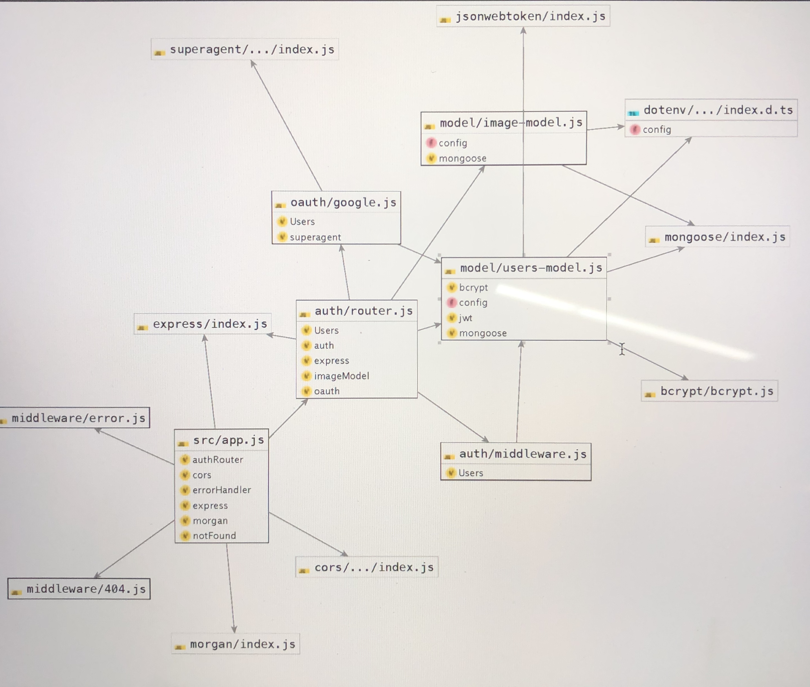

## Lab15

#### Purpose:
GRADED pair programming assignment

Authors: Alistair & Avrey

#### travis:
https://github.com/Alwynblake/Lab15/pull/3

#### back-end:
https://lab15auth.herokuapp.com/

#### Tests
`npm run test`

#### UML

